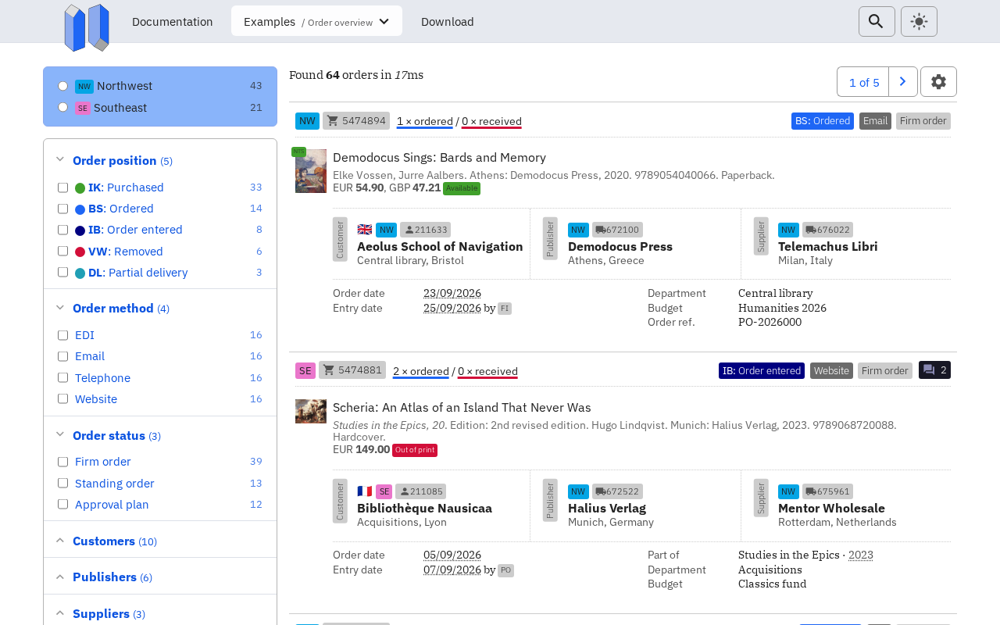
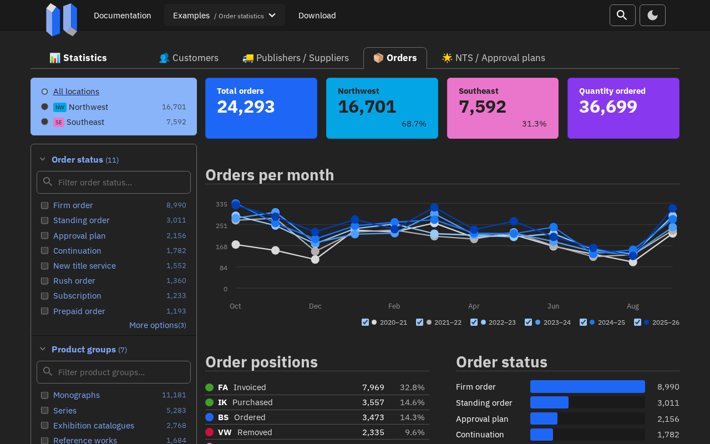
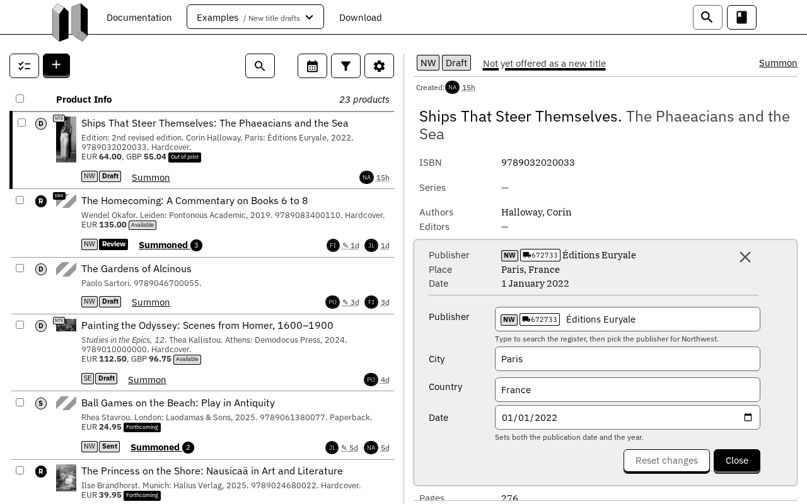

# Nausikaä

CSS building blocks for accessible websites.

Nausikaä is one stylesheet that makes plain HTML look good and work for
everyone: with a keyboard or a screen reader, on a phone or a wide monitor, in
light or in dark. A button looks like a button, a table like a table and a
dialog like a dialog, without a single class.

- One stylesheet, about 36 kB gzipped
- No JavaScript and no build step
- Five themes: light, dark, high contrast light and dark, and e-ink
- Free for everyone, under the MIT License

Documentation, examples and the download are at <https://nausikaa.site>.

## Use it

Download `nausikaa.min.css` from <https://nausikaa.site/download>, put it with
the rest of your site and link it in the `<head>` of every page.

```html
<meta name="viewport" content="width=device-width, initial-scale=1">
<link rel="stylesheet" href="https://fonts.googleapis.com/css?family=IBM+Plex+Mono:400,700|IBM+Plex+Sans:300,400,500,700|IBM+Plex+Serif:300,400,700">
<link rel="stylesheet" href="/styles/nausikaa.min.css">
```

The viewport tag matters: without it, phones show a zoomed-out desktop page.
The second line loads the IBM Plex typefaces. Without them the text falls back
to Georgia and Arial, and everything keeps working.

Then write HTML:

```html
<main>
  <article>
    <h1>Reserve a book</h1>
    <p>We keep it at the desk for <strong>three days</strong>.</p>

    <p>
      <label for="title">Title</label>
      <input type="text" id="title">
    </p>
    <p><button>Reserve</button></p>
  </article>
</main>
```

Classes only come in where HTML has no word for something: a color, a size, or
a pattern such as a navbar or a product card.

## What it looks like

Three of the examples from the documentation, each in one of the themes. An
order overview in the light theme:



A page of statistics in the dark theme and a work list with a form in the
e-ink theme:

| Dark | E-ink |
| --- | --- |
|  |  |

## What is in it

| Group | Parts |
| --- | --- |
| Foundations | Getting started, theming, accessibility, responsive design |
| Elements | Typography, links, buttons, input fields, checkboxes and radios, images, tables, progress bars |
| Components | Breadcrumbs, containers, dialogs, dropdowns, notifications, pagination, panels, spinners, tabs, tags |
| Collections | Articles, navbar, gallery, forms, products, charts, sidebar, site overview, users, code example |
| Utilities | Calendar, date picker, editor |

The elements, components and collections are CSS only. The three utilities are
optional React components that use the same styles; you do not need them, or
React, to use the stylesheet.

The optional icon set is in `images/icons.svg`.

## Utilities

The calendar, the date picker and the editor are React components in the same
package. Install what the one you use needs, and import it by name:

```bash
npm install nausikaa react date-fns
```

```js
import "nausikaa/nausikaa.min.css";
import Calendar from "nausikaa/calendar";
import DatePicker from "nausikaa/date-picker";
import Editor from "nausikaa/editor";
```

The calendar and the date picker need React and date-fns. The editor also needs
Tiptap; `package.json` lists the packages under `peerDependencies`. All of them
are optional, so installing Nausikaä for its stylesheet installs nothing else.

The utilities take their icons from `images/icons.svg`, which they expect at
`/images/icons.svg`. Pass the `icons` prop if you serve it somewhere else.

## Themes

The light and dark themes follow the visitor's system setting. Set
`data-theme` on the `<html>` element to choose one yourself:

```html
<html lang="en" data-theme="dark">
```

The values are `light`, `dark` and `eink`. The e-ink theme is black on white,
for e-readers and other e-ink screens.

## Accessibility

Nausikaä aims at WCAG 2.2 level AA, the level the European Accessibility Act
asks for. It takes care of contrast, one clear focus outline, the forced colors
of high contrast themes, reduced motion for those who ask for it, text that
grows with the browser's font size, and layouts that hold up on a phone and
when zoomed in. Menus and toggles are `<details>` elements, so they work with
the keyboard and screen readers without a script. Headings in order, labels
and alt texts stay up to you.

It does not get everything right yet. The documentation lists the known
limitations under Foundations, Accessibility.

## Browser support

Every browser released since early 2021: Chrome and Edge from 89, Firefox from
75, Safari from 12.1, Samsung Internet from 15 and Opera from 75. Older
browsers skip a few details; nothing breaks.

## Documentation

The documentation is at <https://nausikaa.site>. Every part comes with a
description, samples and the HTML to copy, and the examples put the parts
together in full pages: an order overview, an invoice, a work list with a form,
a calendar and a page of statistics.

## Build it yourself

The source is plain CSS in `styles/`, in small files: one per element,
component or collection.

```bash
git clone https://github.com/mibdw/nausikaa.git
cd nausikaa
npm install
npm run build
```

This writes `dist/nausikaa.min.css` and the three utilities. `npm run dev`
rebuilds the stylesheet on every change.

## License

Nausikaä is released under the [MIT License](LICENSE).

The icons, the typefaces and the other work by others keep their own licenses.
See [THIRD-PARTY-NOTICES.md](THIRD-PARTY-NOTICES.md).

Questions: <ben@mibdw.club>
